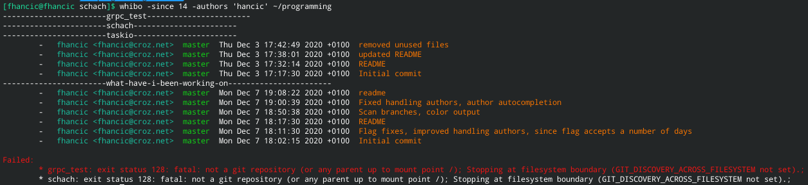

# what-have-i-been-working-on (whibo)

List all your recent work in git repos. Perfect for bad time-trackers and will-do-it-laters.

## Usage

* `go run ./ -since 14 -authors 'author1,author2' ~/work` when in project root
    * lists all your work in the last 14 days, targetting author1 or author2 (case insensitive) git commit authors
* `whibo -since 2 -authors 'author1,author2' ~/work`
* `whibo -since 7 --group-by-branches ~/work` - get author name from git config, group commits by branches
* `whibo -since 14 -authors thisAuthor -o yaml` - get yaml output of commits in the last 14 days, matching case
  insensitive author name

## Installation

* position to the project root directory
* `go build -o whibo`
* `sudo cp whibo /usr/local/bin/`
* `whibo -h`

## Example output

```
-----------------------project-1-----------------------
        -   fhancic <fhancic@gmail.com>  master  Fri Dec 4 17:34:28 2020 +0100  Commiting
        -   fhancic <fhancic@gmail.com>  master  Fri Dec 4 11:15:36 2020 +0100  Doing stuff 
        -   fhancic <fhancic@gmail.com>  master  Fri Dec 4 11:02:57 2020 +0100  Fix 
        -   fhancic <fhancic@gmail.com>  master  Mon Nov 30 16:55:12 2020 +0100  Fix of a fix 
-----------------------my-personal-project-----------------------
-----------------------another-unfinished-project-----------------------
-----------------------my-react-app-----------------------
        -   fhancic <fhancic@gmail.com>  feature/ci-cd-pipeline  Tue Dec 1 12:20:53 2020 +0100  done 
        -   fhancic <fhancic@gmail.com>  feature/ci-cd-pipeline  Tue Dec 1 12:18:33 2020 +0100  currently doing
        -   fhancic <fhancic@gmail.com>  feature/ci-cd-pipeline  Mon Nov 30 14:35:48 2020 +0100  fixes
        -   fhancic <fhancic@gmail.com>  feature/ci-cd-pipeline  Mon Nov 30 13:51:12 2020 +0100  initial skeleton
        -   fhancic <fhancic@gmail.com>  feature/ci-cd-pipeline  Mon Nov 30 13:13:23 2020 +0100  documentation
-----------------------work-project-----------------------
 
Failed: 
        * not_a_git_repo: exit status 128
```


